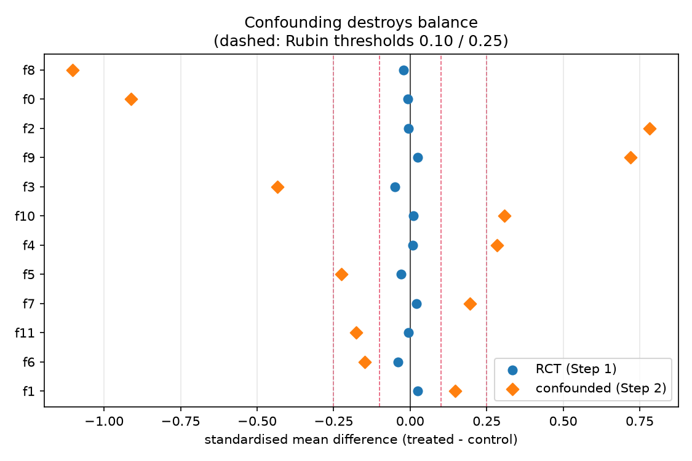
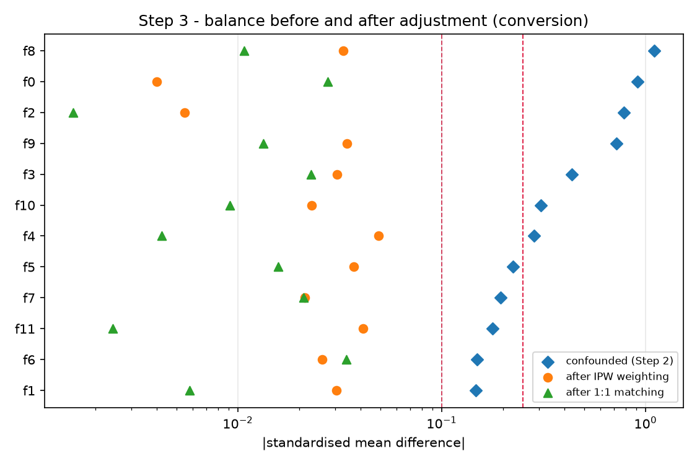
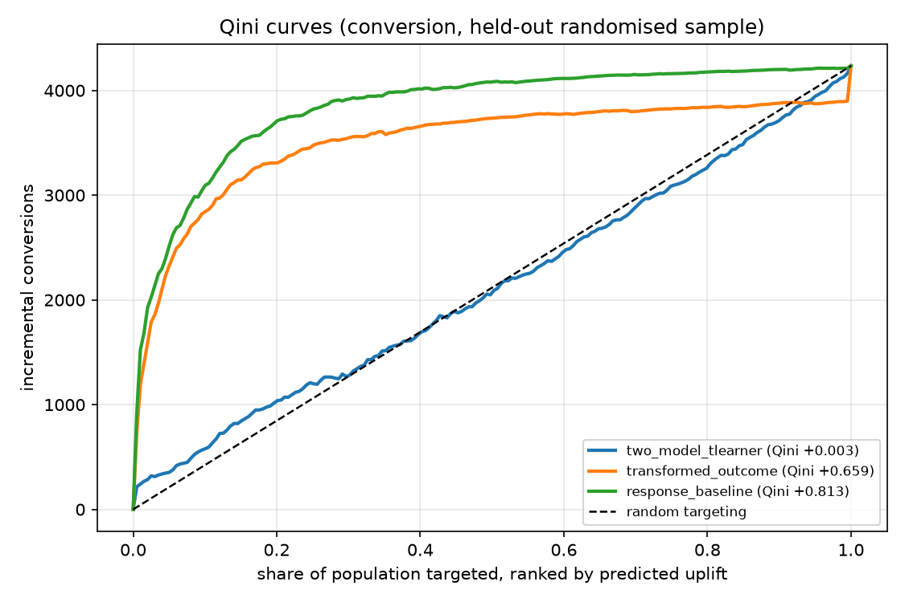

# Recovering a Known Causal Effect from Deliberately Broken Data

Causal inference on the [Criteo Uplift Prediction dataset](https://huggingface.co/datasets/criteo/criteo-uplift)
— 14.0M rows of real display-advertising impressions with a randomised
treatment flag.

The randomisation gives a **known answer**. So instead of estimating an effect
and hoping, this project destroys the randomisation on purpose, applies the
standard observational toolkit to the wreckage, and scores each method against
the truth it was supposed to find.

**Headline result.** After confounding pushes the naive estimate to **+237%**
of the truth (and, in the mirror scenario, to the **wrong sign**), only one
estimator lands within single digits in all four test conditions:

| estimator | inflate · conversion | deflate · conversion | inflate · visit | deflate · visit |
|---|---|---|---|---|
| naive (no adjustment) | +237% | −882% | +595% | −2024% |
| IPW (gradient-boosted PS) | −92% | −0.1% | −49% | −0.2% |
| **AIPW, doubly robust (GBM PS)** | **+4.6%** | **−8.3%** | **−8.4%** | **−5.3%** |
| PSM 1:1 NN (GBM PS) | −11% | −19% | +13% | −20% |
| g-computation | −34% | +34% | +11% | −10% |
| IPW (linear PS) | −283% | +182% | −1439% | +329% |
| AIPW (linear PS) | +548% | −34% | −67% | −7.6% |
| DiD, parallel trends | +22% | −169% | +0.3% | −0.7% |
| DiD, trends violated | +80% | −87% | +164% | +131% |

Bias against an RCT-derived target re-standardised onto exactly the rows each
estimator used. Full tables: [`reports/step3_recovery_inflate.md`](reports/step3_recovery_inflate.md),
[`reports/step3_recovery_deflate.md`](reports/step3_recovery_deflate.md).

---

## Contents

- [What this demonstrates](#what-this-demonstrates)
- [The dataset, and three things about it that bite](#the-dataset-and-three-things-about-it-that-bite)
- [Step 1 — ground truth](#step-1--ground-truth)
- [Step 2 — breaking randomisation on purpose](#step-2--breaking-randomisation-on-purpose)
- [Step 3 — recovery, and what balance diagnostics do not tell you](#step-3--recovery-and-what-balance-diagnostics-do-not-tell-you)
- [Step 3, part two: sensitivity when there is no answer key](#step-3-part-two-sensitivity-when-there-is-no-answer-key)
- [Step 4 — uplift modelling, including a result I did not want](#step-4--uplift-modelling-including-a-result-i-did-not-want)
- [Step 5 — the GenAI layer (built, not run)](#step-5--the-genai-layer-built-not-run)
- [Step 6 — deployment](#step-6--deployment)
- [Identifying assumptions, and where they break](#identifying-assumptions-and-where-they-break)
- [Running it](#running-it)
- [Project structure](#project-structure)
- [What I deliberately left out](#what-i-deliberately-left-out)

---

## What this demonstrates

| Competency | Where to look |
|---|---|
| **Causal inference** | PSM, IPW, AIPW, g-computation, DiD, placebo tests, balance diagnostics — all scored against RCT ground truth: [`src/uplift/estimators.py`](src/uplift/estimators.py), [`src/uplift/did.py`](src/uplift/did.py) |
| **Sensitivity analysis** | Rosenbaum bounds and E-values, and a demonstration that a *high* E-value can mean a *worse* estimate: [`src/uplift/sensitivity.py`](src/uplift/sensitivity.py) |
| **Knowing when a method is lying** | Effective sample size reported beside every weighted estimate; matching's understated intervals called out in the code that produces them |
| **Scale** | 14.0M rows end to end, no subsampling; chunked normal equations instead of a 3 GB design matrix ([`stats.lin_ate`](src/uplift/stats.py)) |
| **Ranking / propensity** | Cross-fitted propensity scores, uplift ranking, Qini, Precision@K, next-best-action: [`src/uplift/uplift.py`](src/uplift/uplift.py) |
| **GenAI engineering** | Rubric, LLM-as-judge, deterministic rule scoring, **negative controls**, weighted-kappa agreement: [`src/uplift/genai/`](src/uplift/genai/) — built, not yet run (see below) |
| **Production** | FastAPI + Docker, gated retrain, drift monitor, 70 tests: [`src/uplift/serving/`](src/uplift/serving/) |

---

## The dataset, and three things about it that bite

**13,979,592 rows**, 85% treated / 15% control, with `visit` and `conversion`
labels and 12 anonymised features `f0..f11`.

> **On the row count.** Most write-ups say 25M. That is the withdrawn v1
> release. v2.1 — the only version Criteo currently distributes — is 13.98M
> rows. The canonical URL (`go.criteo.net/...`) is also dead as of 2026-09;
> [`src/uplift/config.py`](src/uplift/config.py) points at Criteo's HuggingFace
> mirror, which serves the identical file.

**1. The rows are impressions, not people.** 13.98M rows carry only **9.17M
distinct covariate vectors**. `f2` is the only feature that varies within an
otherwise identical vector, so the other 11 act as a proxy user id. Treated
units recur more often than control ones — **1.118 vs 1.014 impressions** — so 
classical standard errors are badly too narrow:

| outcome | Welch SE | cluster-robust SE | design effect |
|---|---|---|---|
| `visit` | 0.000146 | 0.000514 | **3.51×** |
| `conversion` | 0.000034 | 0.000069 | **2.01×** |

Every interval in this project is clustered on that proxy id. It is a proxy,
not a real id — 3.4% of clusters span both arms, which a true user id could
not — and the dataset ships nothing better.

**2. The "RCT" is not perfectly balanced at impression level.** Max |SMD|
across the 12 covariates is **0.0488** — under Rubin's 0.10 threshold, but
roughly 50× what clean randomisation at n = 14M would produce. The mechanism is
(1): treated users get more impressions, so the impression-level sample
over-represents heavy users among the treated. Corroboration: the Lin-adjusted
`visit` ATE differs from the raw difference in means by **18 sigma**.

**3. The score is massively tied.** 41% of rows sit in tie blocks of 1,000+;
the largest is 60,049 rows and is 100% treated. Breaking ties by array position
sorts by treatment arm inside a block — which handed one predicted-uplift
decile *zero control units* before I caught it. Ties are averaged in Step 2 (so
the selection probability is an exact function of X) and broken with a seeded
RNG in Step 4 (so buckets keep their treated/control mix).

---

## Step 1 — ground truth

| outcome | control rate | treated rate | ATE (ITT) | relative lift |
|---|---|---|---|---|
| `visit` | 0.03820 | 0.04854 | **+0.010342** | +27.1% |
| `conversion` | 0.00194 | 0.00309 | **+0.001152** | +59.4% |

Conversion runs at **0.29%** — 40,774 positives in 14M rows. That rarity drives
every metric choice in Step 4.

Cross-checked three ways ([`reports/step1_rct_ground_truth.md`](reports/step1_rct_ground_truth.md)):
Lin (2013) regression adjustment, a 100-stratum standardisation, and a
cluster-collapsed user-level estimate. `exposure` is deliberately excluded from
every adjustment set — it is post-treatment, and conditioning on it would open
a collider path. It is used only as an instrument for a CACE, reported with the
caveat that the complier population ("users active enough to be served an ad")
is heavily selected.

---

## Step 2 — breaking randomisation on purpose

Rows are selected into an observational subsample with a probability depending
on **both the arm and a prognostic score** — a control-arm model of the outcome,
holdout AUC 0.947. Treated units are kept preferentially at the top of that
score and controls at the bottom, so the survivors are not comparable.

The direction matters. Selecting on a covariate that does *not* predict the
outcome produces imbalance but **no bias**, which would make Step 3 a
demonstration of nothing.

Result at strength k = 3, on 7.01M retained rows: max |SMD| goes **0.049 →
1.102**, and the naive conversion estimate becomes **3.37× the truth**. The
mirror `deflate` scenario reverses the rule and the naive estimate becomes
**−0.003148 against a true +0.000402** — ads appear to *reduce* conversion.



### The target is not the full-sample ATE

Selecting on X changes the covariate mix, and the effect here is *violently*
heterogeneous — conversion uplift runs from **+0.000038 in the bottom
prognostic decile to +0.008165 in the top, a 215× spread**. So the subsample's
true ATE genuinely differs from the full sample's, and scoring Step 3 against
the full-sample number would charge every estimator for a shift that is not
bias.

Instead the target is re-standardised: stratum-level RCT effects re-weighted by
the subsample's bin shares. Validation — run over the *whole* sample that
machinery must agree with an independent adjustment, and does:

| outcome | raw diff-in-means | Lin-adjusted | 100-stratum standardised | gap |
|---|---|---|---|---|
| `conversion` | +0.001152 | +0.001002 | +0.001005 | **0.29%** |
| `visit` | +0.010342 | +0.007734 | +0.007566 | 2.17% |

A linear interaction regression and a stratification over a gradient-boosted
score are unrelated ways of removing the same imbalance. That they land within
0.3% is the evidence the target is sound.

---

## Step 3 — recovery, and what balance diagnostics do not tell you

The headline table is at the top. The finding underneath it is the one worth
the project:

> **Covariate balance is necessary and nowhere near sufficient.**

IPW weighting drives every |SMD| from as high as **1.10 down to ≤ 0.049** —
textbook balance, the kind that gets a paper past review. The same weights
leave an **effective control sample of 192,289 out of 1,061,480** (max weight
1,171), and the estimate is still **92% biased**.

With the misspecified *linear* propensity it is worse: max weight **74,236**,
effective control sample **4,270 units**, and a `visit` estimate of −0.1586
against a true +0.0118. Nothing in a balance table says any of this. Effective
sample size is printed beside every weighted estimate for exactly that reason.



**Matching's intervals are the other trap.** PSM's CI is **14× narrower** than
AIPW's on identical data, because the matched-pair standard error ignores
both the estimation of the propensity and the reuse of controls under matching
with replacement — for which the bootstrap is [known to be invalid](https://doi.org/10.3982/ECTA6474)
(Abadie & Imbens 2008). PSM's point estimates are respectable (−11% to −20%);
its coverage is not, and the docstring that produces them says so.

**Trimming silently changes the question.** Restricting to e ∈ [0.02, 0.98]
keeps 77.8% of rows — and moves the conversion target from **+0.001603 to
+0.000224**, because common-support trimming discards precisely the
high-propensity units where the uplift lives. Trimmed estimates are therefore
scored against a re-standardised trimmed target, not the original one.

**Placebo tests** (negative-control pre-period outcome, true effect exactly 0):
the naive estimator reports a spurious **+0.003285** while AIPW covers zero.
Twenty permuted-treatment draws centre at −1.8e-05. IPW *fails* this test on
`visit` — another mark against it here.

**DiD** works beautifully on the dense outcome (+0.3% and −0.7% across the two
scenarios on `visit`) and poorly on the rare one (+22%, −169% on `conversion`),
because the synthetic pre-period injects Bernoulli noise of order √p while the
effect itself is ~0.001. The `violated` variant is biased by 80–165% by
construction, which is the point of including it.

---

## Step 3, part two: sensitivity when there is no answer key

Steps 1–3 ask *which estimators recover a known answer*. That question only
exists because randomisation supplied the answer. On real observational data
you are left with the contrapositive: **how strong would an unmeasured
confounder have to be to explain this away?**

Rosenbaum bounds on the 5.95M matched pairs, plus E-values for every estimate
([`reports/step3_sensitivity_inflate.md`](reports/step3_sensitivity_inflate.md)):

| outcome | discordant pairs | Γ\* | target risk ratio | target E-value |
|---|---|---|---|---|
| `conversion` | 55,858 | **1.41** | 1.419 | 2.19 |
| `visit` | 667,295 | **1.31** | 1.187 | 1.66 |

Γ\* = 1.41 means a hidden confounder shifting the odds of treatment by only
41% between two units identical on all 12 covariates would be enough to end
significance. That is *not* robust, and it is the honest verdict on the matched
analysis — consistent with PSM's 11–20% bias in Step 3.

Now the trap. E-values for the conversion estimates:

| estimator | implied RR | E-value | actual bias vs truth |
|---|---|---|---|
| naive (no adjustment) | 2.412 | **4.26** | **+237%** |
| AIPW (GBM PS) | 1.439 | 2.23 | +4.6% |
| *RCT-derived truth* | *1.419* | *2.19* | *—* |
| IPW (GBM PS) | 1.033 | 1.22 | −92% |

**The most biased estimator has the largest E-value.** Reported on its own,
"you would need a confounder with RR 4.26 to overturn this" sounds like
strength — but the naive estimate is 237% wrong, and its big E-value only
reflects that it is claiming a big effect. An E-value measures *the size of the
claim*, never *whether the claim is right*. AIPW's E-value (2.23) lands almost
exactly on the truth's (2.19), which is what a well-adjusted estimate looks
like.

I would not have seen this without the RCT to check against, which is the whole
argument for building the project this way round.

---

## Step 4 — uplift modelling, including a result I did not want

Trained on 10.4M rows, evaluated on 3.60M held out, **split by cluster** so no
user's impressions land on both sides.

| model | Qini | uplift @ top 10% | vs untargeted | captured share @ 10% |
|---|---|---|---|---|
| two-model T-learner | +0.0033 | +0.001868 | 1.35× | 13.5% |
| transformed outcome | +0.6590 | +0.009090 | 6.58× | 65.8% |
| **response baseline** | **+0.8133** | +0.009902 | **7.17×** | 71.7% |



Two uncomfortable findings, reported because they are true:

**The two-model T-learner is indistinguishable from random targeting.** It is
the first thing most people reach for. On a 0.29% outcome it differences two
models each of which is *larger than the effect between them*, and the errors
do not cancel.

**A plain response model — `P(convert|X)`, no causal content whatsoever — ranks
uplift better than either causal learner.** Not a bug. On this data uplift is
close to proportional to baseline conversion propensity (Step 2's decile table
shows both rising together), so the response ordering is nearly the uplift
ordering and is estimated far more precisely. The lesson generalises: **uplift
modelling must be justified against a response baseline**, and most write-ups
never run that comparison.

The served model is still the transformed-outcome learner, deliberately: a
response model emits P(convert), not an increment, so it cannot answer *how
much extra conversion one more impression buys* — which is what a bidder needs
to set a price.

**Class imbalance handled honestly.** AUC-PR **0.1834** against a 0.00338 base
rate (**54.3×** a random ranker), plus a calibration table. Accuracy is not
reported anywhere: predicting "never converts" scores 99.66% and means nothing.

---

## Step 5 — the GenAI layer (built, not run)

⚠️ **The code is complete and committed; no live model has been called.** There
are no cost or latency figures in this repo because measuring them requires
credentials I have not wired up, and inventing them would be worse than
omitting them. Run it with `--backend anthropic` or `--backend bedrock` to
populate the cache and the numbers.

What is built ([`src/uplift/genai/`](src/uplift/genai/), [`scripts/05_genai.py`](scripts/05_genai.py)):

- **Provider abstraction** over the Anthropic API and Bedrock, with a
  content-addressed response cache and a `replay` backend, so once run the
  whole evaluation reproduces offline and a reviewer scores *exactly* the
  outputs that were scored originally.
- **A written rubric** whose two heaviest criteria are dataset-specific:
  *groundedness* (the features are anonymised — any output describing the
  segment demographically has hallucinated) and *causal correctness* (base
  conversion rate is not uplift; recommending a segment "because they convert
  often" is the error the previous four steps exist to prevent).
- **Three raters**: deterministic rules, an LLM judge, and a human spot-check
  sheet, with quadratic-weighted Cohen's kappa between each pair. Unweighted
  kappa would treat a 4-vs-5 disagreement as badly as 1-vs-5.
- **Negative controls** — outputs corrupted on purpose with invented
  demographics, fabricated revenue figures, and a confident call on a null
  result. A judge that scores those highly is not a judge. Without them,
  "the LLM judge gave us 4.6/5" is unfalsifiable.

---

## Step 6 — deployment

Deliberately small. At L4 "production" means *something else depends on my
model*, not *I own the serving platform*.

- **FastAPI service** — `/health` (reports whether the artefact actually
  loaded, not just liveness), `/model`, `/score`. Verified in-container:
  **3.5 ms** for a 2-row batch, malformed input → 422 not 500.
- **Docker** — multi-stage, non-root, healthcheck that greps `model_loaded`.
  667 MB.
- **Gated retrain** ([`scripts/retrain.py`](scripts/retrain.py)) — promotes to
  `models/current` only if holdout Qini clears an absolute floor *and* does not
  regress more than 10% below the incumbent. Every attempt is appended to
  `models/registry.jsonl`. A retrain that silently overwrites a good model with
  a worse one is worse than no retrain.
- **Drift monitor** ([`scripts/monitor_drift.py`](scripts/monitor_drift.py)) —
  per-feature PSI plus prediction-distribution drift, exits non-zero so a
  scheduler can page on it.
- **Scheduled weekly** via [`.github/workflows/retrain.yml`](.github/workflows/retrain.yml).

Two bugs the drift monitor had, and what fixed them — both are the kind that
ship silently:

| symptom | cause | fix |
|---|---|---|
| PSI > 11 against its own training data | reference approximated as normal from stored mean/sd; these features are nowhere near normal | artefact now stores a binned empirical distribution per feature — same check reads **PSI < 0.01** |
| prediction drift alarm on every run | assumed 10% of traffic per decile; tied scores collide the quantile thresholds, so training really produces 31% in the top three | artefact stores the realised decile shares; drift is measured against those |

---

## Identifying assumptions, and where they break

The part that matters. Each claim in this repo rests on assumptions that are
*not* verifiable from the data alone.

**1. Unconfoundedness given X** — `(Y(0), Y(1)) ⊥ T | X`. Steps 3's estimates
are only causal if the 12 covariates capture everything driving both selection
and outcome.

*Here it holds by construction*, and that is the entire trick: I wrote the
selection rule, so I know it is a function of X alone. Ties are averaged
precisely so that selection cannot depend on file position as well as X.
**On real observational ad data this assumption is the whole ballgame and is
usually false** — bid-time context, competitive pressure, and user intent are
rarely all in the feature set. Nothing in this repo validates unconfoundedness
on data where you did not write the selection rule. That is not a limitation of
the code; it is the nature of the assumption.

**2. Positivity / overlap** — every unit must have a non-degenerate chance of
either arm. The construction keeps the true propensity roughly within
[0.22, 0.99], so overlap is technically satisfied but *thin at the top* — which
is exactly why IPW's effective control sample collapses to 192k and why
trimming moves the estimand so much. **Where it breaks in practice:** any
targeting rule with a hard eligibility cut (geography, device, frequency caps)
produces true zeros, and no amount of weighting recovers an effect for units
that could never have been treated. Check ESS, not just balance.

**3. SUTVA / no interference** — one user's treatment does not affect another's
outcome. **Where it breaks:** auction-based advertising is close to a worst
case. Suppressing ads to a control group lowers competition and changes the
price and win rate for everyone else. The control arm is not a clean untreated
world. This dataset cannot detect that, and the estimates inherit the problem.

**4. The cluster proxy** — 3.4% of clusters span both arms, so it is not a true
user id. If the proxy under-merges, the cluster-robust SEs are still too narrow.
Design effects of 2.0–3.5× should be read as *lower bounds* on the correction.

**5. Parallel trends (DiD)** — **imposed, not tested.** The dataset has no time
dimension, so the pre-period is simulated. The `parallel` variant recovers the
effect because I built it to, and the `violated` variant fails because I built
it to. This demonstrates the mechanics and the failure shape; **it is not
evidence that DiD identifies anything on this data**, and I would not present it
as such.

**6. Exclusion restriction (CACE)** — assignment affects conversion only by
serving an ad. Plausible, but the complier population is "users active enough to
be served", which is why the CACE is 28.7pp on `visit` — the compliers were
already browsing.

**7. The re-standardised target** — assumes the effect is constant within each
of 100 prognostic bins. With ~140k rows per bin the residual heterogeneity is
small, and the 0.29% agreement with Lin adjustment supports it, but it is an
approximation, not an identity.

---

## Running it

```bash
uv venv --python 3.12 .venv && uv pip install -e ".[dev,serve]"

# ~311 MB download, then 14M rows -> 169 MB parquet in ~25s
curl -L -o data/raw/criteo-research-uplift-v2.1.csv.gz \
  https://huggingface.co/datasets/criteo/criteo-uplift/resolve/main/criteo-research-uplift-v2.1.csv.gz
python scripts/00_ingest.py

python scripts/01_rct_ground_truth.py               # 35s
python scripts/02_confound.py                       # 109s (+80s on the first run, to fit the prognostic score)
python scripts/03_recover.py --direction inflate    # 20-30 min, the expensive one
python scripts/03_sensitivity.py                    # 101s, Rosenbaum bounds + E-values
python scripts/04_uplift.py                         # 239s
# python scripts/05_genai.py --backend anthropic   # needs credentials

python scripts/retrain.py                  # trains + gates + promotes
python scripts/monitor_drift.py --sample 200000
docker build -t criteo-uplift . && docker run -p 8000:8000 criteo-uplift
```

`scripts/03_recover.py --sample 300000` runs the whole estimator suite in ~2
minutes if you want to see it work before committing 23.

### Reproducibility

Every number in this README was reproduced on a second machine at a different
filesystem path. Across roughly sixty values spanning all five stages, from row
counts to Qini coefficients to effective sample sizes, the two runs agreed to
every digit printed. The single exception was the placebo AIPW point estimate,
+0.000314 against +0.000015; both cover zero, which is the whole claim, and
LightGBM's row subsampling is not bit-stable under different thread scheduling.

Timings are from an unloaded 8-core Windows machine. Step 3 fits 30 gradient
boosted models over 7M rows, so it is sensitive to anything else competing for
the disk. On one run with a cloud sync client mirroring the 912 MB data
directory it took 2h13m instead of 23 minutes, with identical results. Keep the
project outside a synced folder.

**Tests: 70, all passing,** and they need no dataset — the causal tests are
self-contained simulations with known ground truth:

```bash
pytest -q
```

The one worth reading is `test_aipw_is_doubly_robust`: it asserts recovery when
the propensity is right and the outcome model is garbage, recovery when the
outcome model is right and the propensity is garbage, **and failure when both
are wrong** — the honest half of the claim.

---

## Project structure

```
src/uplift/
  config.py        paths, column names, the cluster key
  data.py          chunked, validated CSV -> parquet + provenance manifest
  stats.py         diff-in-means, SMD, Lin ATE, cluster-robust SE, Wald ratio
  confound.py      Step 2: prognostic score, selection rule, re-standardised target
  estimators.py    Step 3: propensity, IPW, AIPW, g-computation, PSM, balance
  did.py           synthetic pre-period, DiD, placebo tests
  sensitivity.py   Rosenbaum bounds, E-values
  uplift.py        Step 4: transformed outcome, Qini, deciles, Precision@K
  genai/           Step 5: provider, rubric, judge, agreement statistics
  serving/         Step 6: model artefact + FastAPI app
scripts/           00..05 pipeline, retrain, monitor_drift
reports/           committed results: json, markdown, figures
tests/             70 tests
```

---

